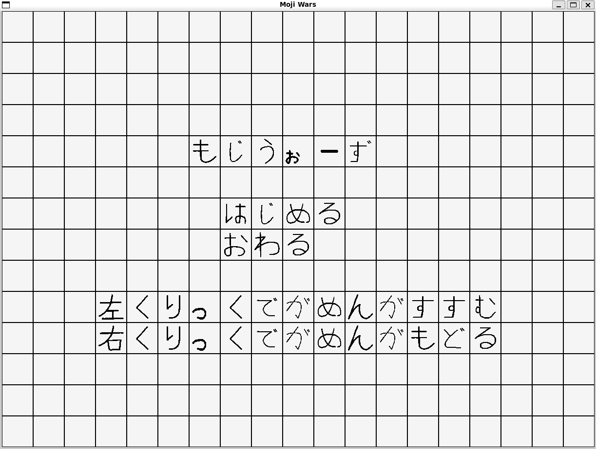
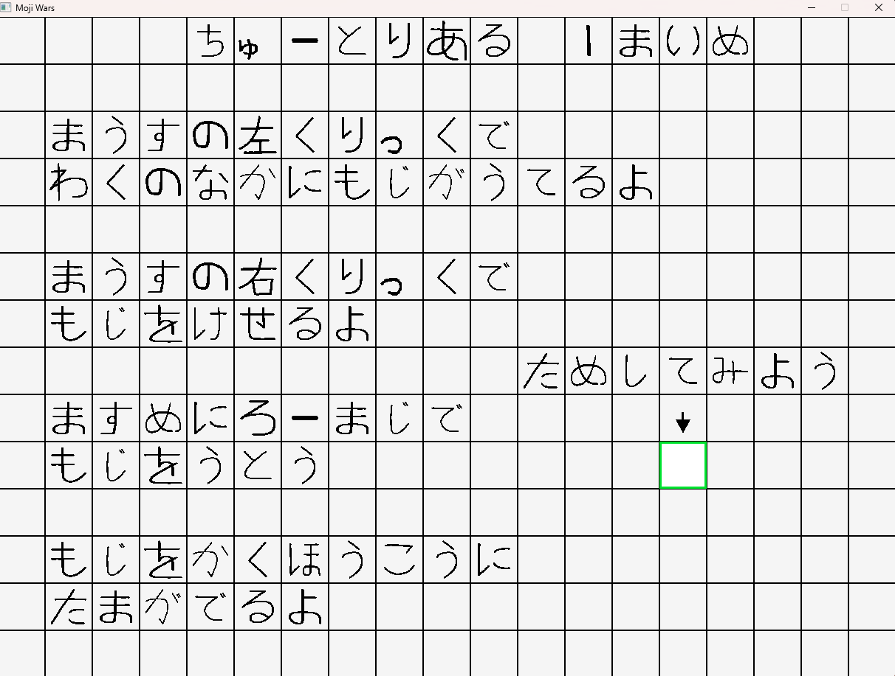
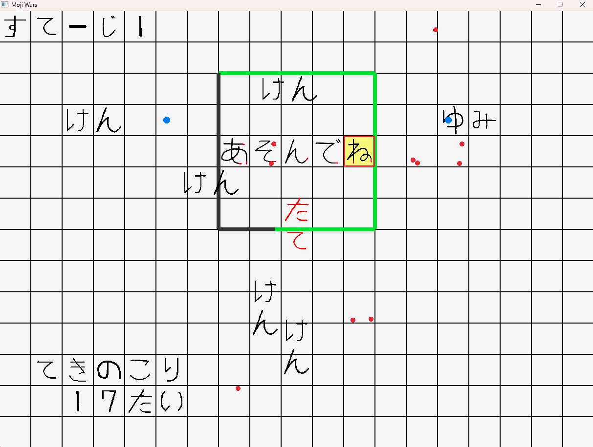

## ゲームについて

**ゲームタイトル：もじうぉーず**

2025年度、東京理科大学 RICORAプログラミングサークルの理大祭展示作品として、C++とゲームライブラリraylibを用いて個人開発した2D見下ろし型タワーディフェンスゲームです。

プレイヤーはひらがなをフィールドに配置し、各文字の「書き順・形」に基づいた方向へ自動で弾を発射させることで、押し寄せる敵を迎撃します。ローマ字入力によるリアルタイム操作と、文字の種類・配置戦略が勝敗を左右するゲーム性が特徴です。

**技術的なこだわり：**
- **ユーティリティベースAI**：盤面の防御密度をリアルタイムに評価し、守りが薄い方向へ敵をスポーンさせる敵AIを実装しました。
- **適応型難易度**：直近5体の撃破時間（TTK）をもとにスポーン間隔を動的に調整し、プレイヤーの実力に応じた難易度を実現しました。
- **テクスチャキャッシュ**：`std::map` によるキャッシュでGPUへの転送コストを削減しました。
- **データ駆動設計**：弾の発射位置・文字スケールを外部テキストファイルで管理し、専用エディタも実装しました。
- **画像の自動透過処理**：白背景PNGからアルファ値を自動生成し、アセット制作の負担を削減しました。
- **クロスプラットフォーム対応**：Linux向けネイティブバイナリとMinGWによるWindows向けクロスコンパイルに対応しました。

詳細な参考資料についてはこちらからご確認ください。：[個人製作ゲームの参考資料.pdf](docs/個人製作ゲームの参考資料.pdf)

## ゲーム紹介動画

[](https://www.youtube.com/watch?v=mYgpoLSNX4I)

## 動作環境
対応機種：PC（Windows上のWSL2 / Linux）  
ゲーム画面：1216×896  
（補足：プレイする際はペンとメモ用紙を用意することを推奨します）  

## 使用素材
使用したSE：効果音ラボ  
使用したBGM：魔王魂

## 実行方法

### パターン1：Windows向け配布版（推奨）

[Releases](https://github.com/RatHorse200/MojiWars/releases) から `MojiWars_windows.zip` を入手して、以下の手順で実行します。

**必要環境：** Windows（WSL2不要）

1. `MojiWars_windows.zip` を任意のフォルダに展開する
2. `MojiWars_windows.exe` をダブルクリックして起動する

---

### パターン2：Linux向け配布版

[Releases](https://github.com/RatHorse200/MojiWars/releases) から `MojiWars_linux.tar.gz` を入手して、以下の手順で実行します。

**必要環境：** Linux または Windows（WSL2）

```bash
tar -xzf MojiWars_linux.tar.gz
chmod +x MojiWars_linux
./MojiWars_linux
```

---

### パターン3：GitHubからビルドして実行（WSL2 / Linux）

**必要環境：**
- Linux または Windows（WSL2）
- raylib 6.x系

**raylibのインストール（Ubuntu / WSL2）：**
```bash
sudo apt update
sudo apt install libraylib-dev
```

バージョンが古い（6.x未満）場合は [raylib 公式](https://github.com/raysan5/raylib/releases) からソースをビルドしてください。

**ビルド・実行手順：**
```bash
git clone https://github.com/RatHorse200/MojiWars.git
cd MojiWars
make
./bin/MojiWars_linux
```

> **注意：** 現在、GitHubリポジトリ版では音楽（BGM・SE）が正常に再生されないバグがあります。

## ゲームのチュートリアル
### 基本
１．枠に囲まれたマスをマウスで左クリックします。    
２．マス目にローマ字で文字を打ちます。     
３．文字を書く方向に弾が発射され、敵を倒します。  
４．敵を全滅させるとステージクリアです。5つ全てのステージをクリアしましょう！   
   
・マウスの右クリックで文字を消せます。    
・文字は敵の弾に当たると消えます。   
・敵本体や敵の弾がフィールドの枠に当たるとダメージを受け（枠が黒くなる）、枠の色が全て黒になるとゲームオーバーとなります。     

### 難易度選択
かんたん：置ける文字は8文字まで、同じ文字は2個まで置けます。      
むずかしい：置ける文字は5文字まで、同じ文字は1個しか置けません。   

### 敵の種類  
ゆみ：遠くから攻撃して文字を消します。また、その場で静止します。（体力：6）     
（ゆみの発射する弾で受けるダメージは、敵ごとに10回までです。また、フィールド内の斜め方向で攻撃できる範囲にしかスポーンしません。）     
けん：まっすぐ進みます。（体力：16、進む速度：0.25マス/s）     
たて：正面から受けるダメージが低いですが、まっすぐ進むのが遅いです。（体力16、進む速度：0.125マス/s、正面から受けるダメージは半減される）     

### ヒント
ヒント１：ゆみとたては斜めから攻撃するか、たくさんの文字で一気に倒しましょう。   
ヒント２：強そうな平仮名は覚えておくか、紙にメモを取って必要な時に使えるようにしましょう。   

## ゲーム画面説明

### スタート画面

「はじめる」を左クリック：チュートリアルへ  
「おわる」を左クリック：終了  
ESC：終了  

### チュートリアル画面

任意の箇所を左クリック：次のチュートリアル画面へ  
任意の箇所を右クリック：前のチュートリアル画面へ  
ESC：終了  

### ゲーム画面

左クリック：マス選択  
キーボード：ローマ字入力でひらがなを入力  
右クリック：文字を削除、選択取り消し  
ESC：終了   

## 敵AI

### ユーティリティベースAI

敵がスポーンするたびに、フィールドの各辺の防御状況を評価してスポーン方向を決定します。

防御密度は「その辺に向けて発射できる弾の数」で測定します：

- **左側の防御密度** = 左上・左・左下方向の発射点の合計数 ÷ 25
- **右側の防御密度** = 右上・右・右下方向の発射点の合計数 ÷ 25
- **下側の防御密度** = 左下・下・右下方向の発射点の合計数 ÷ 25

各方向のスポーン重み = `max(0.1, 1.0 - 防御密度)`

防御が薄いほど重みが高くなり、その方向から敵がスポーンしやすくなります。重みを確率として使った**重み付きランダム選択**で方向を決定するため、完全に読める挙動にはなりません。

### 適応型難易度

直近5体の撃破時間（TTK: Time To Kill）の平均をもとに、スポーン間隔を自動調整します。

| 平均TTK | 判定 | スポーン間隔 |
|---------|------|------------|
| 8秒未満 | 撃破が速い＝余裕あり | 短くなる（最大×0.7） |
| 8〜20秒 | 普通 | 変化なし（×1.0） |
| 20秒超 | 撃破が遅い＝苦戦中 | 長くなる（最大×1.5） |

急激な変化を抑えるため、倍率は現在値と目標値を70:30で混合して緩やかに変化します。

## ディレクトリ構造

```
MojiWars/
├── src/                  # ソースコード
│   ├── main.cpp
│   ├── audio.cpp / audio.h
│   ├── board.cpp / board.h
│   ├── enemy.cpp / enemy.h
│   ├── ai.cpp / ai.h
│   ├── sprites.cpp / sprites.h
│   ├── title.cpp / title.h
│   ├── tutorial.cpp / tutorial.h
│   ├── char_fire.cpp / char_fire.h
│   ├── romaji.cpp / romaji.h
│   ├── constants.h
│   ├── fire_editor.cpp   # 発射位置設定ツール
│   └── viewer_editor.cpp # スケール調整ツール
├── assets/
│   ├── black_ch/         # タイトル・チュートリアル・敵の文字スプライト
│   ├── red_ch/           # ゲームプレイ用ひらがなスプライト
│   ├── music/            # BGM・SE
│   ├── char_fire.txt     # 文字ごとの弾発射位置データ
│   ├── char_scale.txt    # 文字ごとのスケールデータ
│   └── tutorial.txt      # チュートリアルテキスト
├── bin/                  # ビルド済みバイナリ（gitignore対象）
│   ├── MojiWars_linux
│   └── MojiWars_windows.exe
├── docs/                 # 紹介用メディア・参考資料
│   ├── 1.png
│   ├── 2.png
│   ├── 3.png
│   └── 個人製作ゲームの参考資料.pdf
├── Makefile
└── README.md
```

## デモプレイ

[](https://www.youtube.com/watch?v=NdsWEiACGhM)

## スクリーンショット





## ローマ字入力例
| 入力 | 結果 |
|------|------|
| a | あ |
| i | い |
| u | う |
| e | え |
| o | お |
| ka | か |
| ki | き |
| ku | く |
| ke | け |
| ko | こ |
| sa | さ |
| shi / si | し |
| su | す |
| se | せ |
| so | そ |
| ta | た |
| chi / ti | ち |
| tsu / tu | つ |
| te | て |
| to | と |
| na | な |
| ni | に |
| nu | ぬ |
| ne | ね |
| no | の |
| ha | は |
| hi | ひ |
| fu / hu | ふ |
| he | へ |
| ho | ほ |
| ma | ま |
| mi | み |
| mu | む |
| me | め |
| mo | も |
| ya | や |
| yu | ゆ |
| yo | よ |
| ra | ら |
| ri | り |
| ru | る |
| re | れ |
| ro | ろ |
| wa | わ |
| wo | を |
| nn | ん |
| ga | が |
| gi | ぎ |
| gu | ぐ |
| ge | げ |
| go | ご |
| za | ざ |
| ji / zi | じ |
| zu | ず |
| ze | ぜ |
| zo | ぞ |
| da | だ |
| di | ぢ |
| du | づ |
| de | で |
| do | ど |
| ba | ば |
| bi | び |
| bu | ぶ |
| be | べ |
| bo | ぼ |
| pa | ぱ |
| pi | ぴ |
| pu | ぷ |
| pe | ぺ |
| po | ぽ |